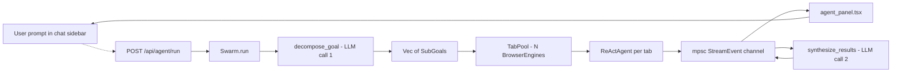
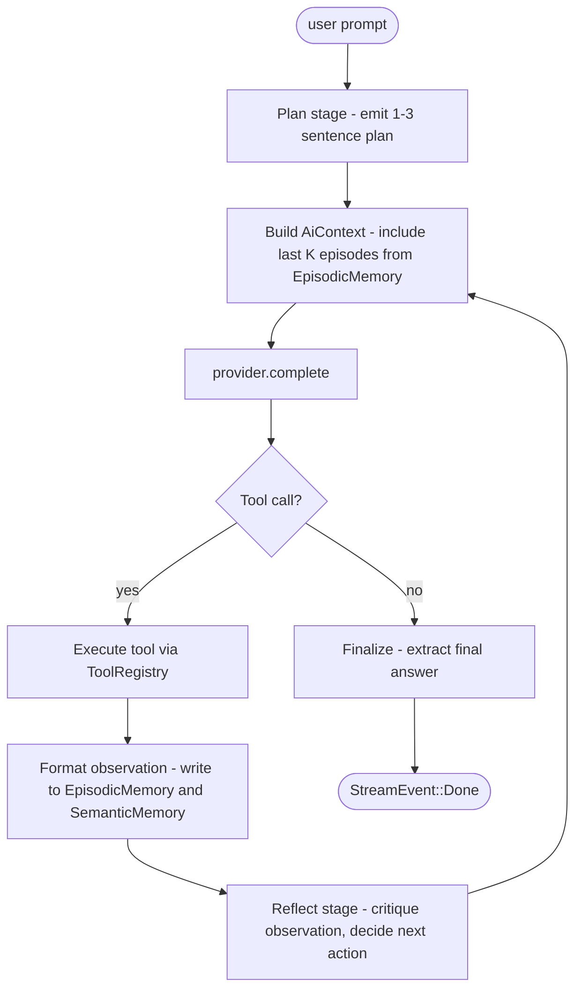

# hyperbrowser-app-examples → neurobrowser: A Deep-Dive Analysis

**Author:** analysis pass over both repos, 2026-07-01
**Scope:** what's worth lifting from hyperbrowser-app-examples for neurobrowser, what to leave behind, and where we should differentiate
**Reading time:** ~15 min

---

## 1. TL;DR

- hyperbrowser-app-examples is a **showcase of 45 mostly-thin Next.js apps** that all funnel into a single hosted product: the `@hyperbrowser/sdk` cloud-browser API. Almost every app's "intelligence" is delegated to Hyperbrowser's server-side `hyperAgent`; the examples themselves are mostly UX shells with hard-coded prompts and cheerio extraction.
- For neurobrowser, the **architectural patterns** in the repo matter far more than any specific app. The three worth lifting are: (a) hyperswarm's *decompose → fan-out → synthesize* LLM pipeline, (b) yc-research-bot's *parallel aspect extraction* with `Promise.allSettled`, and (c) agent-web-index's framing of a *benchmark harness over an agent* (relevant for neurobrowser's testing strategy).
- hyperscript's "NL → TypeScript" is **mostly cosmetic**: the `generateScript.ts` is a string template that interpolates the user's prompt into a fixed `client.agents.hyperAgent.start({ task: ... })` call. The "code generation" happens server-side at hyperbrowser.ai, not in the app. We should not pattern-match on it literally; we should pattern-match on the *shape* (task + URL + step budget → streamed run).
- neurobrowser already has a **strong foundation**: a real `ReActAgent` (`src/agent/mod.rs`), an 11-tool registry with `BrowserInterface` abstraction, pluggable AI providers (OpenAI/Anthropic/Ollama), three-tier memory (episodic/semantic/state), and a `StreamingAgent` trait. The work isn't building primitives — it's upgrading the *loop*.
- Concrete recommendations in priority order: **(P0)** teach the existing loop to *plan → act → reflect* (deep-researcher pattern); **(P0)** swap the "concatenate observation into prompt" pattern for a structured memory write; **(P1)** add a `Swarm` orchestrator that decomposes a goal into N sub-goals and synthesizes a final answer; **(P2)** keep CAPTCHA/proxy as an *optional delegate to Hyperbrowser's API*, never a v1 dependency.

---

## 2. What is hyperbrowser-app-examples, really?

[hyperbrowserai/hyperbrowser-app-examples](https://github.com/hyperbrowserai/hyperbrowser-app-examples) is a 45-app monorepo. Every app:

1. Is a Next.js 14/15 frontend.
2. Calls the `@hyperbrowser/sdk` TypeScript SDK.
3. Wraps one or more calls to `client.agents.hyperAgent.start({ task, llm, maxSteps, sessionOptions })` — the hosted "HyperAgent" — or to `client.scrape.startAndWait({ url, formats, sessionOptions })`.
4. Streams the result back to a React component.

What the examples are **not**:

- They are **not** browser agents running on the user's machine. The browser lives in Hyperbrowser's cloud.
- They are **not** standalone LLM-driven workflows. Almost every "agent" call passes a single natural-language task string to the hosted HyperAgent and waits for a final result.
- They are **not** especially differentiated from each other. Roughly 30 of the 45 apps are "scrape this site, summarize with GPT, render results" with different branding.

The repo's *marketing surface* (e.g. hyperscript's demo video of NL → TypeScript → execution) overstates the client-side sophistication. The *engineering surface* is small and uniform. This is good news for neurobrowser: there are very few specific things to copy, but the **architectural primitives** (decompose → fan-out → synthesize, parallel aspect extraction, streaming `liveUrl` for a UI to embed) are reusable.

---

## 3. neurobrowser today (baseline)

Before mapping patterns, here's what neurobrowser actually has — the foundation is more substantial than the GitHub "0 stars, 2 commits" implies.

### Architecture (from `src/lib.rs` + `src/agent/mod.rs`)

```
neurobrowser/src/
├── lib.rs               # public API exports
├── agent/
│   ├── mod.rs           # ReActAgent (async, mutex-guarded state)
│   ├── memory.rs        # AgentMemory { episodic, semantic, state }
│   ├── observability.rs # tracing spans
│   └── streaming.rs     # StreamingAgent trait + StreamEvent enum
├── browser/mod.rs       # BrowserEngine (scraper crate), BrowserInterface impl
├── providers/
│   ├── mod.rs           # AiProvider trait, AiContext, ProviderConfig
│   ├── openai.rs
│   ├── anthropic.rs
│   └── ollama.rs
├── session/mod.rs       # SessionManager, PageHandle
└── tools/
    ├── mod.rs           # BrowserTool trait, ToolRegistry, PageInfo types
    ├── contracts.rs
    └── errors.rs
```

### What's already built

| Capability | Where | Status |
|---|---|---|
| Pluggable AI providers (OpenAI, Anthropic, Ollama) | `src/providers/` | implemented |
| ReAct agent with async loop | `src/agent/mod.rs::ReActAgent` | implemented |
| Streaming agent trait | `src/agent/streaming.rs` | trait only, not wired into ReActAgent |
| 11 browser tools (DOM, links, prices, tables, click/type/scroll/submit) | `src/browser/mod.rs` + `src/tools/` | implemented (some stubs) |
| Three-tier memory (episodic / semantic / state) | `src/agent/memory.rs` | data structures only — `EpisodicMemory::push` exists but is never called from the loop |
| Tauri desktop shell + URL bar / tab UI | `src-tauri/` | blocked on icons/config |
| Session + page management | `src/session/mod.rs` | implemented |

### What's missing vs. what the Hyperbrowser examples do well

| Gap | What hyperbrowser-app-examples does | What neurobrowser needs |
|---|---|---|
| **Plan → act → reflect** stages | hyperswarm and yc-research-bot explicitly *plan* before invoking the agent | ReAct loop is a single flat iteration; no plan/reflect stages |
| **Multi-agent fan-out** | hyperswarm decomposes a goal into N parallel HyperAgent runs | No orchestrator; one agent = one browser state |
| **Synthesis across agents** | hyperswarm's `synthesizeSwarm` produces a final answer from N agent results | No equivalent; `extract_final_answer` only parses one response |
| **Episodic memory is wired in** | deep-researcher patterns write observations into a queryable store | `EpisodicMemory` exists but isn't read or written by the loop |
| **Streaming tool events to UI** | hyperscript uses NDJSON over a `ReadableStream` | `StreamEvent` enum exists; not produced by `ReActAgent` |
| **Session-scoped memory** | documentation-buddy, agent-web-index use crawl-then-query over a session | `StateMemory` exists but `session/mod.rs` doesn't write to it |

The takeaway: neurobrowser's *primitives* are largely there. The work is *wiring* them into the loop and adding orchestration.

---

## 4. App-by-app survey (45 apps, classified)

I scanned every top-level subdirectory. Most are 100–500 line Next.js apps that differ mainly in what URL they hit and which LLM prompt they pass to the hosted HyperAgent. Below is the honest classification.

| Category | Apps | What they actually do |
|---|---|---|
| **Hosted-HyperAgent wrappers** (single task → cloud browser → result) | hyperscript, deep-job-researcher, deep-reddit-researcher, yc-research-bot, hyper-research, hyperdatalab, hyperdesign, hyperharness, hyperlearn, hyperpages, hyperplex, hyperrank, hyperfetch, hyperview, hypervision, designmd-url, mediresearch, sora-research, openai-source-forge, phoenix-score, assets-optimizer, hb-job-matcher, hb-pitchdeck, hb-ui-bot-app, podcast-generator-ai, flow-mapper, competitor-tracker, churnhunter, deep-crawler-bot, Idea-generator-reddit, agent-rank, hyperrank, browserbrain | Call `client.agents.hyperAgent.start(...)` with a fixed or templated task. The "intelligence" is hosted. |
| **Multi-agent / swarm orchestration** | hyperswarm | The *only* example with a real client-side LLM pipeline (decompose + synthesize). See §5. |
| **Multi-aspect parallel fan-out** | yc-research-bot (`/api/deep-research`), hyperplex | Runs 4+ parallel HyperAgent calls with different prompts, merges via `Promise.allSettled`. See §5. |
| **Scraping + extraction utilities** | scrape-to-api, site-to-dataset, universal-chatbot, documentation-buddy, web-to-agent, skills-generator, hyperskills | Pure scraping with cheerio + selectors; one (documentation-buddy) builds an index. |
| **Benchmark / evaluation harness** | agent-web-index | An evaluation harness over a Playwright-based web agent. See §5. |
| **Asset analysis / codegen** | hyperdesign, designmd-url, scrape-to-api | Extract structured outputs (design tokens, OpenAPI specs, TS SDKs). |

**Pattern across all 45:** the *client* is a thin shell. The interesting engineering is in the prompts (`hyperswarm/lib/decompose.ts`, `hyperswarm/lib/synthesize.ts`) and the parallel orchestration (`yc-research-bot/app/api/deep-research/route.ts`).

---

## 5. Deep dives

### 5.1 hyperswarm — decompose → fan-out → synthesize

**File map:** `hyperswarm/lib/{decompose.ts, swarm-server.ts, synthesize.ts}` + `app/api/{launch-swarm,stop-swarm,rank,synthesize,decompose}/route.ts`.

**What it actually does (corrected from the README's vague pitch):**

1. **Decompose** — OpenAI call (`ORCHESTRATOR_MODEL`) takes a user goal, returns exactly N (5–20) sub-tasks, each with `{ task, url, extractionGoal, siteName }`. Hard constraint: sub-tasks target *different* websites and are *independent*. The system prompt is in `decompose.ts:4–24`.
2. **Fan-out** — `launch-swarm/route.ts` spawns N parallel HyperAgent runs (one per sub-task), each with `maxSteps: 10`. Each agent streams its `liveUrl` and step count to the UI via SSE.
3. **Rank** — a second OpenAI call scores each agent's output against the original goal.
4. **Synthesize** — a third OpenAI call (`synthesize.ts:1–69`) takes the goal, ranked results, and agent outputs and produces `{ headline, recommendation, rankedResults }` for the dashboard.

**What neurobrowser should copy (the pattern, not the language):**

- The **two-stage orchestration LLM**: one prompt to decompose, another to synthesize. This is more reliable than a single "do everything" agent and dramatically easier to debug. Mapped onto neurobrowser, this becomes a `Swarm` orchestrator over `ReActAgent` instances.
- The **structured-output discipline**: both `decompose` and `synthesize` use `response_format: { type: "json_object" }` and validate the shape before continuing. neurobrowser's providers already accept structured outputs (the `ToolCall` system is essentially this); extending it to top-level orchestration is straightforward.
- The **explicit independence constraint** in the decompose prompt ("different site, no ordering dependencies"). For neurobrowser's parallel tabs (10-instance Tab pool per phase 3 of the roadmap), this is a *free* structural win: agents share no state, can run concurrently on different URLs.

**What neurobrowser should NOT copy:**

- The hosted HyperAgent. The whole fan-out is a *server-side* multi-tenant browser. neurobrowser's differentiator is that the agent lives *in the browser*, with full DOM access. Lifting the orchestration pattern but running each agent locally (over `BrowserEngine`) is the right translation.
- The 5–20 sub-task range is fine for cloud research; for a single-user desktop browser, **2–5 parallel agents** is more realistic (memory and CPU budget).

### 5.2 yc-research-bot — parallel aspect extraction with `Promise.allSettled`

**File map:** `yc-research-bot/app/api/deep-research/route.ts:30–45`.

**The pattern (verbatim):**

```typescript
const [websiteAnalysis, socialPresence, competitiveIntel, founderIntel] = await Promise.allSettled([
  analyzeWebsite(company, client),
  analyzeSocialPresence(company, client),
  analyzeCompetitivePosition(company, client),
  analyzeFounders(company, client),
]);
```

Each `analyzeX` function is a separate HyperAgent call with a **focused prompt** (e.g. `analyzeWebsite` asks for tech stack, pricing, team, jobs, blog, testimonials — each call has its own JSON schema). The merge is defensive: failed aspects become `{}` rather than aborting the whole run.

**What neurobrowser should copy:**

- The **single-input / multi-aspect** shape. neurobrowser already has a `BrowserInterface` that exposes the *same* page state. A natural extension is to spawn N aspect-specific queries against the same loaded page in parallel, each with its own prompt + schema, then merge. This is cheaper than hyperswarm (no fan-out across URLs) but captures the same idea.
- The **`Promise.allSettled` semantics**: one failing aspect doesn't kill the rest. neurobrowser's `AgentMemory::semantic` could store per-aspect results with success flags, so a partial run is still useful.
- The **per-aspect JSON schemas**: each analysis has a typed output. This slots directly into the existing `ToolCall` / structured-output path in neurobrowser's providers.

**Concrete landing place:** `src-tauri/src/agent/aspects.rs` (new) — a thin layer that, given a `PageInfo` and a list of `AspectQuery { name, prompt, schema }`, produces a `Vec<AspectResult>`. The ReAct loop can call this as a single "tool" with one user-visible name.

### 5.3 deep-reddit-researcher — extraction patterns worth noting (but not copying the architecture)

**File map:** `deep-reddit-researcher/lib/reddit.ts`, `app/api/search/route.ts`.

This is the most *complete* client-side extraction in the repo — it actually parses Reddit HTML with cheerio, takes screenshots, and builds a structured `Thread[]`. Two observations:

1. **The mock-data fallback** (`reddit.ts:40–88`) is large and the file's overall scraping logic is brittle (Reddit changes CSS selectors often; the file has fallbacks for `data-testid="post-content"`, `[slot="text-body"]`, `.Post-body`, etc.). This is the *opposite* of neurobrowser's value prop — fragile scraping is exactly what a real DOM-rendering browser is supposed to replace.
2. **The `sessionOptions` block** (`useProxy`, `solveCaptchas`, `acceptCookies`, `adblock`) is repeated verbatim across the deep-researcher family. This is the *infrastructure layer* neurobrowser should consciously decline to replicate in v1 — see §7.

**What neurobrowser should copy:** the **typed extraction contract** (`Thread { title, url, shot, snippet, content }`). neurobrowser's `PageInfo` already has this shape; the lesson is to commit to a *named per-domain extraction contract* once we know what we want.

**What neurobrowser should NOT copy:** the cheerio scraping, the mock fallback, and the brittle multi-selector cascade. With a real rendering engine, the agent should be able to ask "what's the title of the first post?" instead of guessing CSS selectors.

### 5.4 agent-web-index — the benchmark-harness pattern

**File map:** `agent-web-index/harness/{tasks.ts, run.ts, engine.ts, score.ts}`.

I expected this to be a crawling/indexing agent. It isn't — it's a **benchmark harness** that evaluates a Playwright-based web agent against a fixed catalog of tasks (e.g. `hacker-news-thread`, `mdn-string-replace`, `books-toscrape-travel`). Each task has an `id`, `url`, `goal`, an `obstacles[]` array, and a `success(page)` function that scores completion.

**What neurobrowser should copy:**

- The **task catalog abstraction**. Once neurobrowser's ReAct agent is mature, having a `tasks/` directory of canonical scenarios (each with a `success()` predicate) is invaluable for regression testing. Phase 4 of the roadmap ("production ready") will hit the same problem.
- The **obstacle annotations** (`obstacles: string[]`). When a task fails, knowing *what kind* of obstacle (CAPTCHA, infinite scroll, dynamic content) tripped the agent is gold for prioritization.

**Concrete landing place:** `research/tasks/` (already exists; currently holds `rust_coding_frameworks.md`). Add `research/tasks/*.toml` files with the same shape.

### 5.5 hyperscript — the headline example, honestly assessed

**File map:** `hyperscript/lib/generateScript.ts`, `app/api/run/route.ts`, `app/page.tsx`.

**The marketing pitch:** "translates plain English task descriptions into runnable TypeScript automation scripts."

**What `generateScript.ts` actually does** (entire function, 79 lines):

- It takes `taskInput` and `urlInput`.
- It returns a hard-coded TypeScript template string with `${task}` and `${url}` interpolated.
- The template calls `client.agents.hyperAgent.start({ task: \`Start at ${url}. ${task}\`, llm: "gpt-4o", maxSteps: 10, ... })`.
- There is **no LLM call** in `generateScript.ts`. The "code generation" is a string template.

The actual *execution* (`/api/run/route.ts`) just calls the same `client.agents.hyperAgent.start` and polls the result every 2 seconds, streaming `{ liveUrl, step, done, error }` events as NDJSON. The TypeScript panel is just for show — the user sees what *would* be sent.

**What neurobrowser should copy:** the *shape* — task + URL + step budget → hosted-or-local browser → stream of progress events. This is essentially the `StreamingAgent::execute_stream` trait neurobrowser already has; the hyperscript implementation validates the contract.

**What neurobrowser should NOT copy:** the cosmetic TS panel. For a *native* browser, the user is *already in* the browser; they don't need a side-by-side code panel. The neurobrowser equivalent is a chat sidebar that shows the agent's reasoning and a status pill (idle / thinking / executing tool / writing) — which is exactly what `AgentStatus` in `src/agent/streaming.rs` already enumerates.

**Concrete landing place:** `src-tauri/src/ui/agent_panel.rs` (new) consumes `mpsc::Receiver<StreamEvent>` and renders the status pill + tool history + final answer.

### 5.6 scrape-to-api — the codegen pattern (and the anti-pattern)

**File map:** `scrape-to-api/lib/codegen.ts`.

This is the cleanest piece of *real* codegen in the repo. It takes user-picked CSS selectors and emits three artifacts:

- An **OpenAPI 3.0 spec** (`generateOpenAPISpec`, lines 18–133)
- A **TypeScript SDK** (`generateTypeScriptSDK`, lines 135–199)
- A **Postman collection** (`generatePostmanCollection`, lines 201–241)

Type inference is sample-data-driven: numeric sample → `number`, href/src attribute → `format: uri`, multi → `array`. Clean, small, easy to read.

**What neurobrowser should copy:**

- The **type inference from sample data**. neurobrowser's `PageInfo` types could be *derived* from a one-shot scrape ("here's what the page looks like, here's what I want to extract") rather than hand-coded. For P2/P3 work, this could feed into neurobrowser's `data export` feature (roadmap P2).
- The **multi-artifact emit** (OpenAPI + SDK + Postman) is the kind of thing a desktop agent could produce as a "save as API" right-click action.

**What neurobrowser should NOT copy:** the *whole framing*. scrape-to-api assumes the user wants to *escape* the web and query it as an API. neurobrowser's thesis is the opposite — *the browser is the API*. If neurobrowser's user wants structured data, they should be able to ask the agent to extract it live, not generate a separate scraping service.

---

## 6. Pattern → neurobrowser mapping (concrete, file-level)

| Hyperbrowser pattern | Neurobrowser landing place | Notes |
|---|---|---|
| hyperswarm's decompose prompt | `src-tauri/src/agent/swarm.rs::decompose_goal` (new) | Reuse `providers::AiProvider::complete` with `response_format: json_object`. Output shape: `Vec<SubGoal>` where each sub-goal has `task`, `url`, `extraction_goal`. |
| hyperswarm's synthesize prompt | `src-tauri/src/agent/swarm.rs::synthesize_results` (new) | Mirror the exact JSON schema `{ headline, recommendation, rankedResults }`. |
| hyperswarm's parallel fan-out | `src-tauri/src/agent/swarm.rs::run_swarm` (new) | Use `tokio::task::JoinSet` (already in `tokio = "full"`). Cap concurrency at 2–5 for desktop, not 5–20. |
| yc-research-bot's parallel aspects | `src-tauri/src/agent/aspects.rs` (new) | Single `PageInfo` in, N aspect queries in parallel, merge with `JoinSet` and per-aspect error capture. |
| hyperscript's streaming run protocol | `src-tauri/src/agent/streaming.rs` (extend) | The `StreamEvent` enum already covers this; just wire `ReActAgent::execute` to emit events through an `mpsc::Sender`. |
| hyperscript's status pill states | `src-tauri/src/ui/agent_panel.rs` (new) | `AgentStatus::{Idle, Thinking, Searching, ExecutingTool, Writing, WaitingForInput}` is the right vocabulary. |
| deep-researcher's typed extraction contract | extend `src/tools/mod.rs::PageInfo` | Add a generic `Extraction<T>` helper that takes a typed schema and runs it against the current page. |
| agent-web-index's task catalog | `research/tasks/*.toml` (new directory) | Each file is `{ id, name, url, goal, obstacles[], success_predicate }`. `docs/CODE_ANALYSIS.md` already references research/ as the right home. |
| scrape-to-api's type inference | `src-tauri/src/export/typed.rs` (new, P3) | Only if/when neurobrowser's "data export" roadmap item is prioritized. |
| Hosted infra (proxy, CAPTCHA, adblock) | **Out of scope for v1.** Document as a future optional delegate via `@hyperbrowser/sdk`-equivalent HTTP API. | See §7. |

---

## 7. Where we should differentiate, not copy

### 7.1 Don't replicate the hosted-browser layer

hyperbrowser's value prop is *CAPTCHA solving, proxy rotation, anti-bot evasion at scale*. neurobrowser's value prop is *single-user, local, private, full-DOM-control*. These are **incompatible** for the same workload. Two clean responses:

- For **personal/local use** (reading articles, comparing products, automating forms the user has credentials for), neurobrowser is strictly better: no telemetry, no per-task cost, lower latency, offline-capable for cached pages.
- For **scale/research** (scraping 1,000s of pages, evading anti-bot, accessing geo-restricted content), Hyperbrowser's hosted model is the right answer.

**Don't** try to build a CAPTCHA solver. **Don't** try to build a proxy network. **Do** leave a clean integration seam (`BrowserEngine` already takes `PageConfig` with `user_agent`; an optional `proxy_url: Option<String>` is a one-line addition) so a future v2 can *delegate* hard-to-render URLs to the Hyperbrowser API as a fallback. This makes them complementary, not competitive.

### 7.2 Don't copy the "task script" model

The Hyperbrowser example apps treat each user request as a *one-shot script*: `task → execute → return`. neurobrowser already has a continuous ReAct loop with memory and tool history. That loop is the **differentiator**. Don't flatten it into a request/response shape just to feel familiar to Hyperbrowser users.

The places where this matters:

- The streaming protocol should expose *every iteration's reasoning*, not just the final answer. `StreamEvent::Status(AgentStatus::Thinking)` already exists; emit it.
- Memory should persist across *requests*, not just within one. `EpisodicMemory::push` exists but isn't read in the next iteration. Fix the wiring first; *then* talk about long-term SQLite storage.

### 7.3 Don't generate code as a user-facing artifact

hyperscript's TS panel is theater for a hosted product. neurobrowser is a real browser — the user is *already running* the code (every tool call is a Rust function executing against the DOM). Show the user *what the agent did* (tool name, args, result), not *what the agent would write if it were TypeScript*.

The closest analogue in neurobrowser is the existing `observability.rs` (`tracing` spans). A future `agent_panel.rs` should surface those spans as a timeline, not as generated source.

### 7.4 Lean into "agentic browser with native reasoning"

The strongest competitive frame from PROJECT.md is: "we control the rendering pipeline." That means we can do things Hyperbrowser's hosted model structurally cannot:

- **Latency**: neurobrowser's `BrowserEngine` parses HTML in-process (`scraper` crate, blocking reqwest). Hyperbrowser's hosted model has round-trip latency per action.
- **Reasoning continuity across tabs**: neurobrowser's `StateMemory` and the future `Swarm` orchestrator can share state across tabs/sessions in-process. Hyperbrowser's hosted model spawns fresh cloud sessions.
- **Privacy**: no data leaves the machine. Hyperbrowser's hosted model inherently exfiltrates URL + rendered HTML to the cloud.
- **Offline / cached content**: neurobrowser can read locally-cached pages without network. Hyperbrowser cannot.
- **Single-user reasoning continuity**: a session-spanning episodic memory (next step, see recommendations) gives neurobrowser the "I remember what you were doing last week" property that no hosted product can offer without storing user data.

These are the lines to lead with in any positioning doc.

---

## 8. Recommendations (priority-ordered)

### P0 — Make the loop a real planning + reflection loop

**Today:** `ReActAgent::execute` in `src/agent/mod.rs:69–133` does a flat loop: prompt → response → tool call → observation → repeat. The "planning" is whatever the LLM happens to think first.

**Target:** introduce explicit stages. Add a new module `src-tauri/src/agent/plan.rs` with:

```rust
pub enum Stage { Plan, Act, Reflect, Finalize }

pub async fn step(&mut self, browser: &dyn BrowserInterface, tx: &mpsc::Sender<StreamEvent>) -> Result<Stage, AgentError>
```

The `Plan` stage emits a brief natural-language plan (1–3 sentences). The `Reflect` stage emits a critique of the last observation ("page didn't have what I expected; need to query a different selector"). The user sees the plan + reflection in the side panel; the LLM sees them in the context.

This is the single highest-leverage change. The hard-researcher pattern (yc-research-bot) and the decompose-then-synthesize pattern (hyperswarm) both rely on a planning stage that the current loop skips.

### P0 — Wire memory into the loop

**Today:** `src/agent/memory.rs` defines `EpisodicMemory`, `SemanticMemory`, `StateMemory` — none of them are read or written by the live loop.

**Target:** in `ReActAgent::execute`:

- Push an `AgentEvent::ToolCall` and `AgentEvent::ToolResult` to `EpisodicMemory::push` (the types already match `streaming.rs`'s `AgentEvent` enum exactly).
- On each iteration, include the last K=5 episodes as a "Recent Activity" block in the context sent to the LLM.
- After each navigation, update `StateMemory::{current_url, page_title, scroll_position}`.

This is the missing piece that turns the agent from "stateless request handler" into "session-spanning reasoning engine." It's also exactly the gap that the deep-researcher family of Hyperbrowser apps *circumvents* by being one-shot — neurobrowser can do better here.

### P1 — Add a Swarm orchestrator

**File:** new `src-tauri/src/agent/swarm.rs`.

Mirror hyperswarm's three-stage pipeline but adapted for in-process execution:

```rust
pub struct Swarm {
    pub provider: Arc<dyn AiProvider + Send + Sync>,
    pub browser_pool: Arc<TabPool>,        // existing concept from roadmap phase 3
    pub max_concurrent: usize,              // 2–5, not 20
}

impl Swarm {
    pub async fn run(&self, goal: &str) -> Result<SwarmResult, AgentError>;
}
```

Each spawned agent is a `ReActAgent` over a separate tab (existing `session/mod.rs::PageHandle`). The orchestrator emits `StreamEvent::SwarmEvent { agent_id, status }` so the UI can show N live cards.

This is *the* feature that differentiates neurobrowser from "AI on Chromium" competitors: a general-purpose ReAct agent that can spawn siblings to parallelize a goal.

### P1 — Add aspect-extraction as a single tool

**File:** new `src-tauri/src/agent/aspects.rs`, exposed as the `extract_aspects` tool in the registry.

Backed by a new `AspectQuery { name, prompt, schema }` and parallel `provider.complete` calls (one per aspect, `JoinSet`). Results merge into a `HashMap<String, serde_json::Value>`. The LLM can call this as a single tool call when it wants structured multi-aspect info from the current page.

This is cheaper than the swarm (single page, no tab spawning) and gives the agent a clean way to ask "give me price, availability, and reviews" in one round trip.

### P2 — Task catalog for regression testing

**File:** `research/tasks/*.toml`.

Follow agent-web-index's shape: `{ id, name, url, goal, obstacles, success_predicate }`. Start with 10 canonical scenarios (e.g. "find product price on Amazon-style page", "fill a login form", "extract article title and author from news site", "navigate to second pagination page").

Each scenario is runnable as `cargo test --test tasks -- scenario_id`. This pays off when the swarm and aspect features land — we need to know they don't regress.

### P2 — Streaming UI panel

**File:** new `src-tauri/src/ui/agent_panel.rs` (Tauri command) + React component in `src-tauri/index.html`'s bundle.

Consume `mpsc::Receiver<StreamEvent>` from the Tauri command, render:

- Current `AgentStatus` as a pill.
- Last 20 tool calls as a timeline.
- Final answer when `StreamEvent::Done` arrives.

This unblocks the user's mental model — they see the agent working, not just a spinner.

### P3 — Optional Hyperbrowser delegate for hostile pages

**File:** new `src-tauri/src/browser/delegate.rs`.

When the local `BrowserEngine` fails (CAPTCHA, 403, geoblocked content), fall back to a Hyperbrowser API call. This is a v2 concern but the *seam* is cheap: `BrowserInterface` is already a trait; add a `DelegatingBrowserEngine` that wraps local + remote.

**Explicitly do NOT do this in v1.** It would create a runtime dependency on a third-party service before the core engine is proven.

---

## 9. Diagrams

### 9.1 Mapped: hyperscript's NL → action pipeline, ported to Rust



### 9.2 Recommended ReAct planning loop



---

## 10. Open questions for James

1. **Provider default for orchestration LLM.** hyperswarm uses `ORCHESTRATOR_MODEL` (whatever's set in OpenAI config). For neurobrowser, the decomposition/synthesis prompts are arguably more demanding than the act loop — should they use a *different* provider than the per-tab agents? (E.g. Claude for planning, Ollama for execution?)

2. **Memory persistence.** Should `EpisodicMemory` survive across browser sessions (SQLite in `~/.neurobrowser/`), or only within a session? The roadmap lists "Session Memory" as P2 — that's in-memory only. Real value comes from cross-session recall; should we promote that to P1?

3. **Tab pool sizing.** Phase 3 of the roadmap calls for 10 concurrent tabs. hyperswarm-style swarms usually run 5–20 agents. Are 10 tabs *enough* for the parallelism story to land, or should we revisit before phase 3 starts?

4. **HTML parsing depth.** `scraper` is HTML-only (no JS). For most Hyperbrowser example targets (Hacker News, Reddit, YC, competitor sites), JS execution matters. Is the headless-Chromium fallback in `blockers.fastrender_integration` still on the table, or are we committed to static-only?

5. **Hostile-page strategy.** If we say "no CAPTCHA solving in v1" (§7.1, §8 P3), what's the *user-visible* story when they hit a Cloudflare challenge? Hide it, error out, or suggest the user disable their VPN?

6. **OpenAPI/SDK generation.** scrape-to-api's `codegen.ts` is the cleanest piece of codegen in the repo. Is "neurobrowser can export any page as a typed API" a roadmap item we want, or is it the kind of "escape hatch" that contradicts the §7.4 thesis?

---

## Appendix A — File index for this analysis

**neurobrowser files referenced:**

- `PROJECT.md` — vision, status, roadmap
- `project.yaml` — machine-readable version
- `Cargo.toml` — dependency list (tokio, reqwest, scraper, async-trait, schemars)
- `src/lib.rs` — public exports
- `src/agent/mod.rs` — `ReActAgent` (lines 69–133 are the main loop)
- `src/agent/memory.rs` — `EpisodicMemory`, `SemanticMemory`, `StateMemory` (data only)
- `src/agent/streaming.rs` — `StreamingAgent` trait + `StreamEvent` enum + `AgentStatus`
- `src/browser/mod.rs` — `BrowserEngine`, `BrowserInterface` impl, 10 tool definitions
- `src/providers/mod.rs` — `AiProvider` trait, `AiContext`, `ToolCall` types
- `src/tools/mod.rs` — `BrowserTool` trait, `ToolRegistry`, `PageInfo` types
- `src/session/mod.rs` — `SessionManager`, `PageHandle`
- `docs/CODE_ANALYSIS.md` — prior refactor report (10 issues fixed)

**hyperbrowser-app-examples files referenced:**

- `hyperscript/lib/generateScript.ts` — the string-template "NL → TS" pipeline
- `hyperscript/app/api/run/route.ts` — streaming run protocol (NDJSON)
- `hyperscript/lib/types.ts` — `RunStreamEvent` discriminated union
- `hyperswarm/lib/decompose.ts` — LLM prompt for goal decomposition
- `hyperswarm/lib/synthesize.ts` — LLM prompt for final synthesis
- `hyperswarm/lib/swarm-server.ts` — parallel task runner over HyperAgent
- `yc-research-bot/app/api/deep-research/route.ts` — parallel aspect extraction (`Promise.allSettled`)
- `deep-reddit-researcher/lib/reddit.ts` — cheerio-based scraping with mock fallback
- `deep-reddit-researcher/app/api/search/route.ts` — request handler
- `scrape-to-api/lib/codegen.ts` — OpenAPI + TS SDK + Postman codegen
- `agent-web-index/harness/tasks.ts` — task catalog shape
- `agent-web-index/harness/engine.ts` — Playwright-based agent under test