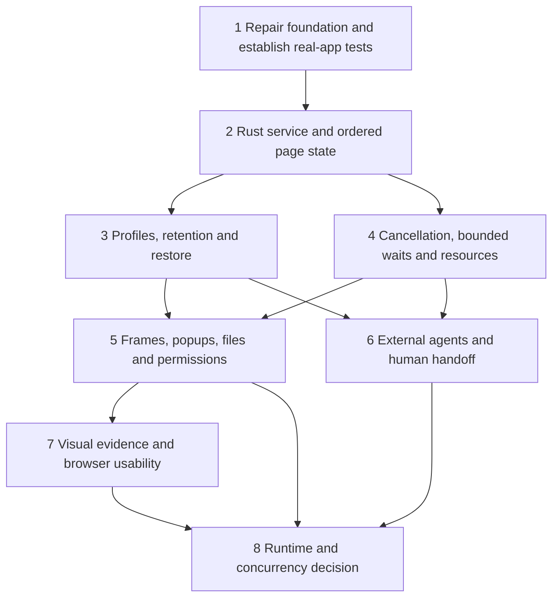

# Neurobrowser Integrated Implementation Plan

**Goal:** A human and an agent can use the same real browser session, understand its current state, perform authorized actions and inspect reliable outcomes, while Rust owns authority, lifecycle and data boundaries.

**Architecture:** Extend the existing Rust capability and session modules into one browser service. Tauri, the agent loop and a future external transport consume that service; OS webviews remain the execution engine. Deliver complete user journeys through small dependent PRs, rather than separate frontend, engine and agent rewrites.

**Stack:** Rust/Tokio, existing HTTP extraction, OS WebKit/webviews, Tauri 2 and React 19. No new engine or provider is selected by this plan.

**Inputs:** [original assessment](neurobrowser-lightpanda-assessment-20261003.md), [verified function audit](20261004-browser-function-audit.md), [probe evidence](20261004-browser-dom-probes.json), and the [folder README](README.md). Implementation source is `<repository-checkout>`; current feature checkout is `<feature-checkout>`. File paths below are relative to that checkout.

## Starting point and constraints

Written against PR [#111](https://github.com/Jimthetaxguy/neurobrowser/pull/111) at head `f50f5ae`, from baseline `d0271f7`. That pull request later merged. This file is the pre-merge proposal. Prior PRs #108–110 were already merged when it was written.

New observations, scoped targets, private single-use approvals and receipts exist. The broader browser audit found input fidelity, shell synchronization, legacy export and lifecycle gaps. Exact-script DOM reproductions are evidence requiring native regression tests, not proof that every native site exhibits identical behavior.

- Rust owns identity, policy, approvals, cancellation, budgets and effect records. Frontend state is a projection; page content never grants authority.
- Keep public `PageSnapshot`, `ToolResult` and `AgentRunResult` compatibility. Add versioned envelopes/methods rather than changing unrelated public layouts.
- Preserve the distinction between dispatch acknowledgment, readiness and a satisfied task predicate. An uncertain consequential action cannot be replayed automatically.
- HTTP is a static runtime; the headless daemon is currently a stub. Advertise only verified capabilities per runtime/platform.
- Keep Tauri/React primary. AppKit receives explicit navigation/state parity; advanced controls need not be duplicated before they work in the primary shell.
- Preserve stored user data and dirty work. Do not delete existing captures, clear profile stores or restore approval grants as a migration shortcut.

## One state and authority model

These concepts must remain distinct even if their first implementation is small:

| Concept | Rust responsibility | Consequence for clients |
| --- | --- | --- |
| Browser profile | Cookie/site-storage ownership, persistence and permissions | Login sharing is explicit; a session UUID does not imply isolation. |
| Task session | Chosen profile, client authority and lifecycle | Human handoff does not silently expand agent authority. |
| Page and browsing context | Native handle, opener/frame ownership and ordered state | Tabs, popups and frames cannot exchange target references or late replies. |
| Document stamp | Navigation/document/relevant-state freshness | Same-document updates and replacement nodes invalidate affected targets/grants. |
| Run and action | Cancellation, approved call, dispatch phase and receipt | Stop reports what may already have happened; it cannot undo website effects. |
| Evidence/capture | Safe observation, explicit retention and provenance | UI, models, logs and memory obey the same export rules. |

Proposed service seam belongs in `src/session/service.rs`. Keep native webview handles behind the existing runtime adapter. Introduce typed identifiers as needed; preserve existing public identifiers at compatibility adapters. The following method names define responsibilities, not a demand for a new framework:

```rust
// Methods on BrowserService; types live in the owning modules listed below.
// All client-facing operations resolve the authenticated ClientContext first.
async fn observe(&self, client: &ClientContext, request: ObserveRequest)
    -> Result<ObservationEnvelope, BrowserError>;
async fn propose(&self, client: &ClientContext, request: ActionProposal)
    -> Result<ProposalResult, BrowserError>;
async fn resolve_approval(&self, client: &ClientContext, request: ApprovalDecision)
    -> Result<ActionReceipt, BrowserError>;
async fn cancel_run(&self, client: &ClientContext, run: RunId)
    -> Result<RunStatus, BrowserError>;
```

`ClientContext` records authenticated principal, human/agent kind and attached session; callers cannot self-assert grants. Requests carry session/page/run IDs and observation or approval references. Mutation proposals also require a stable caller operation ID, bound to authenticated principal, session and exact payload. Repeated delivery returns the existing pending state/status/receipt; reuse with changed payload conflicts. An operation ID must survive transport retries, never be regenerated merely because a response was lost. Define those DTOs beside the service; use existing `ActionReceipt` and the existing agent proposal/approval logic internally. `ObservationEnvelope` adds context identity around existing `PageObservation`. `ProposalResult` distinguishes approval-required, completed and rejected. `BrowserError` distinguishes unsupported, unauthorized, stale, cancelled, deadline, budget and runtime failure. Cancellation after possible dispatch also retains the action receipt. An atomic Rust operation record reserves dispatch ownership before native execution. Slice 3 persists possible-dispatch state before invocation; restart/disconnect cannot convert it into permission to retry. This deduplicates local deliveries, not remote website effects.

`src/session/events.rs` owns a versioned event envelope with session/page/runtime IDs, per-page monotonic sequence and state kind. Native callbacks own native URL/load/termination facts; page-derived title/SPA evidence is labeled and reconciled, never treated as native authority. Clients subscribe before reading initial state, reconcile by sequence, and resync after gaps. Full navigation generates a fresh document identity; closure and renderer recreation retire the runtime identity. Same-document changes advance the relevant revision. Restore creates fresh runtime/document identities.

`src/session/profiles.rs` owns profile selection and lifecycle; `src/capability/evidence.rs` owns safe export; `src/agent/lifecycle.rs` owns run state and cancellation. Avoid duplicating these responsibilities in a new transport or UI hook.

## Dependencies and release checkpoints



Slice 1 is the gate for merging the current foundation. Slices 3 and 4 can proceed concurrently after slice 2 contracts settle, with separate module ownership and shared service/runtime edits handled by the integrator. Slice 5 expands native workflows; slice 6 can initially expose the proven main-document subset. A network/isolation feasibility probe starts in slice 2 and informs every later capability claim; unattended arbitrary-web execution remains gated through slice 8.

Use one integrator for service contracts and final integration. Delegate runtime/native tests, Rust authority/lifecycle and React projections to disjoint owners. A reviewer checks each consequential boundary and each PR's final behavior. Finish one independently usable slice before merging it; do not create a long-lived mega-PR.

## 1. Repair and verify the shared foundation — update PR #111

**Journey:** Open a React form, observe it, approve typing/submission, see the server-confirmed value, follow an in-page link, and switch tabs without stale evidence appearing.

**Files:** `src-tauri/src/runtime.rs`, `src-tauri/src/App.jsx`, `src-tauri/src/hostAdapters.js`, `src-tauri/src/nativePageEvents.js`, `src/capability/tools.rs`, `src-tauri/src/main.rs`; existing frontend/runtime tests, `tests/capability_webkit.swift`, fixture site, `tests/run_capability_webkit.sh`, `.github/workflows/ci.yml`. Add `tests/run_desktop_journeys.sh` and `tests/desktop_journeys/` for the actual assembled app.

- [ ] Before repairs, define at least two cases and success/failure rubrics per original workload class, including explicit unsupported visual/background outcomes. Preserve the current HTTP/native deterministic outcomes, latency and available process/context measurements with pinned configuration and ceilings. Record new measurements per slice; keep provider-driven trials separately budgeted. Extend `tests/browser_benchmark/` incrementally rather than waiting until runtime selection.
- [ ] Reproduce controlled-input, CSS-hidden/inert/disabled control and overridden-click probes in genuine WKWebView. Add a compiled React 19 controlled form and a real POST receiver that records submitted values and request count correlated to the action receipt; the existing ordinary-JS/GET corpus does not establish this. Include native inputs, React controlled inputs and an intentionally unsupported input type. Repair supported input via a tested framework-compatible or native path; reject unsupported types explicitly. Do not claim synthetic events are trusted user gestures.
- [ ] Require rendered/actionable targets at observation and dispatch. Recheck connectedness, relevant state, visibility and hit-test eligibility; scrolling may be a distinct action before clicking. Acknowledgment still does not prove business success.
- [ ] Add native page event subscription to Tauri. Gate global shell URL/status/snapshot writes by active page and request generation; clear them on a new blank tab. Test delayed inactive-page replies, SPA routes, title changes, failed navigation and page closure.
- [ ] Close the legacy export gap: ordinary form values and executable script content must not enter model context or automatic stored snapshots. Until a route shares sanitization, block its automatic capture/export and show the limitation. Preserve pre-existing captures; no silent destructive migration.
- [ ] Diagnose hosted server startup using process stderr, exit status, selected port and health-check logs. Retain the existing ephemeral loopback bind, early-exit detection and cleanup; add an actual health request and preserve diagnostics on readiness timeout. Fix the observed cause, then execute the corpus in CI.
- [ ] First prove assembled-app driver feasibility on pinned macOS/Tauri dependencies. Evaluate test-only embedded WebDriver with command mocking off, or a test-only native driver; direct `tauri-driver` does not support macOS. Drive real frontend `invoke` and child-page report delivery. The native netguard blocks loopback: either use a test-build-only exact fixture-origin grant, unavailable in production and incapable of broad private-network access, or a controlled public TLS fixture. Test the production build still rejects loopback. Then launch the real Tauri app and drive its actual Rust IPC/page route. Check observation → pending approval → one authorized dispatch → receipt → shell update, plus wrong-page report rejection. Keep any test driver behind a test-only build/ACL; do not add production bypasses. Existing WebKit report-bridge tests remain useful but cannot stand in for this journey.

**Merge gate:** Native regressions and assembled-app journey pass; canaries are absent from every current export/capture route; exact-head `./verify.sh` and hosted checks pass; independent review resolves material findings. Update PR description/ADR to match repaired scope. Profile isolation and network confinement remain explicitly unsupported. Do not merge solely because the fixture-server job turns green.

## 2. Centralize browser operations and state — new service PR

**Journey:** The human and an agent attach to one page and see the same ordered state and receipts without mixing identity or policy.

**Files:** `src/session/mod.rs`; create `src/session/service.rs`, `src/session/events.rs`; additive envelopes in `src/capability/mod.rs`; `src/agent/mod.rs`, `src/agent/approval.rs`; `src-tauri/src/main.rs`, `src-tauri/src/runtime.rs`, `src-tauri/src/hostAdapters.js`, `src-tauri/src/nativePageEvents.js`, `src-tauri/src/App.jsx`. Create `tests/browser_service.rs`, `tests/browser_events.rs`; baseline AppKit parity in `NeuroBrowser/ContentViewController.swift`, `NeuroBrowser/BrowserViewController.swift`, `src-tauri/src/appkit.jsx` and `tests/appkit_navigation.swift`.

- [ ] Define the service DTOs described above, including client/session/page/run ownership. Route Tauri and the built-in agent through the same service; keep low-level trusted SDK methods explicitly outside external transport exposure.
- [ ] Add an atomic operation registry: principal/session/operation ID plus exact payload binding, pending/dispatching/receipt state and a single dispatch owner. Duplicate proposal/resolution races return the same status/receipt; changed-payload reuse conflicts. Test lost responses and repeated approvals without extra execution.
- [ ] Preserve page operation ordering and policy-update synchronization. Approval resolution rechecks exact call, current policy, freshness, expiry and authenticated approver before dispatch. Encode human navigation authority separately from agent `ActionPolicy`: direct human navigation can use the human grant, while delegated actions retain the attached agent policy. Preserve the existing ReadOnly prohibition on agent navigation; any new read-with-navigation mode is a separately named policy. Hard network restrictions apply independently to both.
- [ ] Publish ordered page state and lifecycle events; keep React per-page projections. Exercise subscribe/snapshot races, out-of-order delivery, gaps/resync, inactive-page updates, same-document changes, close/recreate and runtime failure. Verify AppKit native navigation/load failure, SPA URL/title changes and late-event handling through its own adapter; advanced evidence/approval controls remain outside this parity gate.
- [ ] Probe WK/native isolated-world instrumentation and datastore APIs with the pinned dependencies. Record platform support and limitations. Treat a main-world bridge as untrusted; refuse stronger hostile-page automation claims where source attribution or dispatch cannot be established. No engine change is selected here.

**Acceptance:** Cross-session/page clients are rejected before runtime access; stale approval resolution cannot dispatch; both clients receive identical action IDs/receipts. Native and page-derived facts remain distinguishable. Existing public struct/serialization compatibility tests pass.

## 3. Make login, privacy and restore explicit — profile PR

**Journey:** A human logs into a named profile, explicitly lends it to an agent, and can also launch an ephemeral job with separate site storage. Restart restores permitted tabs without restoring authority.

**Files:** Create `src/session/profiles.rs`, `src/session/persistence.rs`, `src/capability/evidence.rs`; modify session service, `src-tauri/src/runtime.rs`, `src-tauri/src/main.rs`, `src-tauri/src/App.jsx`, `crates/neuro-memory/src/{capture,model,policy,store}.rs`. Create `tests/browser_profiles.rs`, `tests/evidence_privacy.rs`; extend native journeys.

- [ ] Map persistent named profiles and ephemeral job profiles to real native datastores. Test cookie/localStorage separation with two accounts and a controlled origin; cookies also follow native browser rules. If separate stores cannot be enforced on a platform, return unsupported rather than label a shared view isolated.
- [ ] Default human browsing to an explicitly named persistent profile; agent-created sessions default ephemeral. Sharing an existing profile requires an explicit attachment shown in the UI. OAuth/cookie values stay in the native store, outside DTOs, prompts and logs.
- [ ] Make automatic content retention opt-in per profile/site. Default agent ephemeral sessions to no retained content; existing installs retain old data but adopt safe capture defaults with a visible notice. Centralize safe HTML/text/structured export for both runtimes and all legacy/new model and memory routes. Preserve internally needed values only inside the runtime.
- [ ] Persist minimal profile/tab metadata in a real durable store; use SQLite unless an existing durable service fits better. Persist the operation ledger and commit possible-dispatch state before native invocation. Keep exact-payload binding as a protected keyed fingerprint or credential reference; do not persist sensitive typed values. On restart, incomplete dispatch becomes Unknown and duplicate delivery returns its existing record rather than replaying. Receipt lookup remains authorized for retired sessions without reviving them. Do not serialize cookie tokens or temporary target IDs. Restore fresh sessions/documents, expired/revoked approvals and no automatically resumed mutations. Keep opt-in browsing history separate from necessary restore metadata.
- [ ] Add clear-site-data/profile removal controls with concrete scope and confirmation; cancel dependent runs and close affected contexts before removal. Stage schema migration non-destructively and test rollback without deleting old content.

**Acceptance:** The per-platform capability matrix records positive native two-profile and ephemeral-lifetime tests where advertised, or explicit refusal with capability false where separate stores are unavailable. The service cannot accept an ephemeral-isolation claim backed by a shared store. Synthetic credential/script canaries are absent from provider payloads, UI exports, event/log records and newly persisted content. Restart restores allowed layout/profile association, but old targets and grants fail.

## 4. Own running work, readiness and resource limits — lifecycle PR

**Journey:** A slow SPA completes a requested predicate; Stop or tab closure cancels remaining work and still explains any action already dispatched.

**Files:** Create `src/agent/lifecycle.rs`; modify `src/agent/mod.rs`, `src/providers/{mod,http}.rs`, `src/capability/tools.rs`, `src/browser/mod.rs`, session service/events, native runtime/main and agent UI. Create `tests/run_lifecycle.rs`, `tests/browser_budgets.rs`; extend native SPA fixtures.

- [ ] Implement Rust run states: queued, running, awaiting approval, verifying and terminal completed/cancelled/failed/uncertain. Propagate one cancellation token through provider waits, page lock acquisition, runtime requests and predicate polling. Queue/stop must be ownership checked; cancel acknowledges an actual state transition, not a fabricated success.
- [ ] Replace single postcondition inspection with bounded predicate waiting. Initial defaults: 10-second verification deadline, 200-ms sampling, at most 50 observations, cancellation between samples. Use monotonic time and explicit URL/text/target predicates; subscriptions can reduce polling. Long-lived sockets must not block a satisfied predicate.
- [ ] Preserve receipts if cancellation races with dispatch. Never repeat a mutation to satisfy a predicate. Distinguish timeout, observation unavailable, predicate unsatisfied and unknown dispatch.
- [ ] Bound HTTP bodies before decoding: stream at most 8 MiB including chunked/decompressed data, reject overflow, close the response and skip parsing. Add request/document-scan deadlines and bounded queues. Initial per-client run admission is one active mutation per page and at most two active runs; expose limits and enforce them across attached transports.
- [ ] Implement renderer-termination recovery: fail/drain pending requests, revoke affected references and offer reload with a fresh runtime identity. Measure native memory/process use before setting enforceable thresholds; where process control is unavailable, advertise that limitation instead of claiming a hard memory bound.

**Acceptance:** A controllable real HTTP/provider endpoint proves request cancellation and bounded body handling. Native delayed SPA succeeds; Stop during approval, provider wait, page lock and verification stops later turns. Stop after possible dispatch leaves a receipt and causes zero automatic replays. Closing/recovering a tab never resurrects its grants. Crash after dispatch reservation, lost responses and reconnect return existing/Unknown receipts and never create a second dispatch for the same operation.

## 5. Support native web workflows in owned contexts — staged workflow PRs

**Journey:** A logged-in task traverses a same-origin iframe or popup, selects a permitted file, and downloads a result; the human sees the origin, destination and ownership throughout.

**Files:** Create `src/capability/contexts.rs`, `src/session/files.rs`, `src/session/permissions.rs`; modify service/profile/events, native runtime/main, evidence/approval UI and fixture corpus. Add separate native tests for contexts, files and permissions.

- [ ] Add context IDs and document stamps for supported frames and open shadow roots. Approval binds context/origin as well as target. Recheck ancestry and navigation immediately before dispatch. Closed shadow roots and uninstrumentable/cross-origin contexts report explicit omissions/unsupported; never tunnel through an unverified boundary.
- [ ] Add bounded scoped target search/pagination so useful controls beyond the first 80 are reachable. Cursor validity binds document/context/revision; improve labels, `aria-labelledby`, selection/disabled states and browser chrome keyboard accessibility.
- [ ] Map supported `window.open`/SSO popups to owned tabs with opener and profile; reject unowned contexts and enforce navigation authority. Verify auth return through a local OAuth-compatible flow, then a scoped real-provider smoke when configured.
- [ ] Govern uploads with native user-selected file handles, fixed allowed scope and per-action approval. Agent paths cannot become ambient filesystem authority. For downloads, Rust owns origin, filename validation, destination reservation, size limit, partial-file lifecycle and cancel/result evidence; executable or colliding filenames receive explicit review.
- [ ] Introduce origin/profile-scoped camera, microphone, location and notification permission records. Default to ask/deny; agents cannot approve their own permission prompt. Platform-unavailable hooks remain unsupported, including engine-default behavior that cannot be governed reliably.

**Acceptance:** Frame navigation invalidates grants; shadow/late-page targets cannot cross contexts. Popup ownership/profile stay correct. Upload canaries stay out of observations/logs; filename traversal and collision never overwrite existing files. Downloads cancel cleanly without claiming completion. Permission rejection and remembered scope are exercised in the native app.

## 6. Expose a first-class external agent and human handoff — transport PR

**Journey:** An external agent attaches to an authorized session, observes the same evidence, requests a consequential action, and pauses while the human reviews it in Neurobrowser.

**Files:** Create `src/transport/mod.rs`, `src/transport/mcp.rs` and `tests/mcp_browser_service.rs`; modify library exports, service/events, primary agent/approval UI and protocol documentation. Replace daemon stub behavior only for capabilities backed by a real runtime.

- [ ] Expose authenticated session attach/list, capabilities, observe, propose, approval status, receipts, subscribe/resync and cancel through a local MCP transport. Prefer local stdio launch or OS-scoped IPC; do not open a public unauthenticated listener. Transport identity/attachment binds the client principal; do not accept arbitrary profile or approval authority in tool JSON.
- [ ] Advertise static HTTP and attached desktop capabilities separately. An absent desktop host returns unsupported/unavailable; no fake headless navigation. Policy and retention apply through the service on every tool call.
- [ ] Show active controller/run, approval context, live progress, Stop and Take over in the primary shell. Taking over cancels/pauses agent work and invalidates pending grants; the human can return control explicitly. Concurrent controllers cannot acquire contradictory mutation leases.
- [ ] Run one configured external agent against the real native fixture journey and then a scoped public site. Preserve request/receipt evidence with redacted provenance; protocol conformance tests alone do not prove integration.

**Acceptance:** Spoofed attachment, stale approval and raw legacy mutation calls are rejected. Closing the transport cancels owned runs according to an explicit lease. Human and external agent agree on profile/page/state and no consequential action is duplicated across handoff.

## 7. Complete visual evidence and everyday usability — product PRs

**Journey:** A human can search, navigate history, zoom, recover a tab and judge a visual result; an agent receives genuine page pixels only when authorized and useful.

**Files:** Native runtime/service, new additive visual contracts in capability module, `src-tauri/src/EvidencePanel.jsx`, `src-tauri/src/App.jsx`, `src-tauri/src/styles.css`, host adapters, primary chrome tests and native journeys; `src/session/persistence.rs` for opt-in bookmarks/history.

- [ ] Implement genuine native screenshots with page/context identity, viewport, timestamp and byte/dimension limits. Screenshots contain visible private data: require explicit visual-evidence authority and disable automatic image retention. Use fixtures to verify pixel provenance and account for capture permissions; never substitute text rendered into an image.
- [ ] Add an explicit omnibox URL-versus-search rule: accepted HTTP(S) URLs navigate; other text becomes a properly escaped query only after the human has selected a search provider. Show the resulting destination; no unsolicited provider request or remote keystroke suggestions. Keep local-memory suggestions separate and apply agent navigation policy to agent search. Add browser chrome find-in-page, explicit zoom/reset, back/forward/loading/error controls and crash/reopen behavior. Add native printing only where supported and governed. Use real page keyboard/accessibility tests; focus must remain understandable across webview, shell and approval card.
- [ ] Add opt-in bookmarks/history using the existing durable metadata store and profile retention policy. Keep advanced AppKit controls explicitly out of parity until independently tested; maintain its navigation/event baseline.

**Acceptance:** Visual task evidence refers to the correct page after tab changes, never an unrelated window. Keyboard-only navigation/approval works; find/zoom/history/recovery work in the assembled app. Unsupported print/capture behavior is visible rather than silently simulated.

## 8. Measure the complete capability and decide background architecture

**Journey:** Compare real static, JS, stateful, visual and concurrent research tasks with recorded correctness, resource use and authority limits.

**Files:** Extend `tests/fixtures/capability-site/` and receipt tooling; add `tests/browser_benchmark/`; runtime/service/netguard and documentation change only after an experiment demonstrates the need. Keep results in this existing evidence bundle.

- [ ] Complete the baseline corpus introduced in slice 1 with at least two independently authored cases per workload class, including negative cases. Compare against the preserved initial and per-slice receipts instead of inventing a baseline after implementation. Fix provider/model/configuration and authorize provider cost before running; use three attempts per task and record failures, retries and unsupported outcomes. Separate deterministic contract tests from provider-driven success rates.
- [ ] Measure cold/warm latency, full process-tree memory, observation/model context, provider cost and two concurrent jobs. Pin machine/runtime/configuration and resource/cost ceilings before runs. Attribution must distinguish engine load, extraction, provider wait and recovery.
- [ ] Exercise actual connection enforcement for redirects, DNS changes, private/final peers, fetch/XHR, WebSockets, workers and subresources. Observe real deny/allow outcomes at connection boundaries; URL preflight and passive logs cannot establish confinement. Keep desktop capability false unless an enforcing solution is demonstrated.
- [ ] Compare improvements to existing native lifecycle with one bounded alternative runtime only if measured gaps remain. Background arbitrary-web operation requires actual isolated profiles, cancellation, enforceable networking/resource containment and teardown. Without those, restrict the experiment to the controlled corpus and report the limitation.
- [ ] Record a decision: keep current runtimes, add a specific adapter, or retain unsupported capability. Any selected adapter must pass the same authority/evidence/lifecycle journeys before it can be advertised. No dependency is chosen for benchmark popularity alone.

**Acceptance:** Reproducible receipts cover all five classes and disclose unsupported cases; decisions follow measured bottlenecks. Background readiness is a separate gate, not inferred from MCP availability or a successful desktop click.

## Verification, review and handoff

Native driver reference: [official Tauri WebDriver guidance](https://v2.tauri.app/develop/tests/webdriver/) describes macOS embedded-driver support and the limitation of direct `tauri-driver`. Dependency/API feasibility must be verified against this checkout before adopting a test-only driver.

For each slice, first add a regression that demonstrates its failure or unsupported behavior; then implement and run the owning suite. The assembled-app fixture server is a real local web service; adapters/fakes are limited to unit tests. Use one record of receipts per reviewed commit, including server traces for consequential actions and explicit omitted provider/platform runs.

Established commands from checkout root:

```bash
cargo check
cargo test --all-targets
cargo test --manifest-path crates/neuro-memory/Cargo.toml
npm --prefix src-tauri test
npm --prefix src-tauri run build
cargo test --manifest-path src-tauri/Cargo.toml --locked --test runtime_capabilities
bash tests/run_capability_webkit.sh
./verify.sh
```

Slice 1 adds `bash tests/run_desktop_journeys.sh`; subsequent slices extend that runner and wire it into `verify.sh` and hosted macOS CI. New Rust integration files are collected by `cargo test --all-targets`; native profile/workflow assertions must also execute in the assembled app. Test-only permissions never ship in production capability manifests. Other supported OS versions require their own native evidence before equivalent support is advertised.

Review focus, with owning slices: (1) human/agent or tab handoff during an in-flight reply [1,2,6]; (2) sensitive ordinary inputs or screenshots crossing retention boundaries [1,3,7]; (3) application-delayed updates and stop-after-dispatch [1,4]; (4) login/popups/frames changing ownership [3,5]; (5) hostile page methods, connection paths and resource exhaustion [2,4,8]. Each appears in the acceptance tests above.

Before every PR checkpoint: align remote state, preserve unrelated work, run required checks on the exact candidate, resolve independent review, update `CONTEXT.md`/ADR/capability matrix and this living effort's receipt links. Do not restore temporary targets/grants, promise remote exactly-once effects or turn an unsupported platform limitation into a green capability flag.

Rollback follows the ownership boundary: disable the new capability/transport, cancel owned runs, restore the previous executable and preserve native profile stores and durable data. Additive persistence migrations retain backward-readable records or verified backups. Rolling back cannot reverse a website transaction; retain its receipt and present uncertainty where needed.

Plan review: native-workload and authority specialists reviewed this proposal. Incorporated real React/POST evidence, driver and fixture feasibility, platform-dependent profile refusal, AppKit/search ownership, operation deduplication with durable uncertainty, and baseline measurement before repairs.
