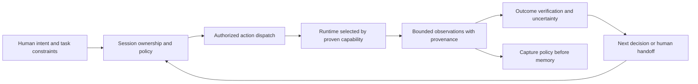

# NeuroBrowser: independent design plan

Design NeuroBrowser from its own purpose: help a human and their agents make reliable, authorized progress on the web, with understandable evidence of what happened. Decompose that job before selecting an engine. Lightpanda is one source of prior art; it does not define our architecture, API, benchmark or implementation.

James's latest direction supersedes this assessment's earlier recommendation to pilot a Lightpanda adapter. The new recommendation is to measure NeuroBrowser's actual workloads and strengthen its own observation, authority and outcome contracts first. Runtime selection remains open. This is a completed planning assessment; experiments and implementation have not been performed.

The source baseline is clean `main` at `d0271f7929e69abd6496e9b670852991bc300d56`, aligned with `origin/main` after a fresh fetch. The [PR closeout](README.md#local-provenance) remains complete. The original assessment is preserved in [its dated backup](README.md#local-provenance).

## Start with the job

A browser task needs a trustworthy account of relevant page state, a way to select an action, authority to perform it, a runtime that can execute it, and evidence of its outcome. Faster loading only improves the execution component. A smaller observation that omits the deciding fact, or a successful click on the wrong target, still fails the task.

Three perspectives shape the design:

- The human needs visible context, clear approval requests, understandable results and a usable handoff when an agent gets stuck.
- The agent needs enough current evidence to choose a target and distinguish unsupported behavior, a dispatched action, an uncertain result and a verified outcome.
- The system owner needs enforceable authority, explicit session ownership, controlled data retention and resource costs that remain bounded across concurrent tasks.

The overlap is reliable progress with evidence. The tension is that reducing page state and resource use can remove information or capabilities needed for that progress. We should resolve that tension with task evidence rather than a universal preference for headless browsing.

| Workload | Evidence needed for success | Initial baseline | Question to resolve |
| --- | --- | --- | --- |
| Read a static page or table | Correct relevant content with source URL | Existing HTTP backend | Can extraction preserve meaning while reducing unnecessary context? |
| Read JavaScript-populated content | Content from actual executed page state | Existing desktop webview | Is execution, readiness detection or observation the main failure/cost? |
| Act in a stateful workflow | Correct target, approved dispatch and observable result | Existing policy-gated desktop path | Can stale targets and ambiguous outcomes be handled without accidental repeats? |
| Make a visual judgment | Evidence of layout or appearance sufficient for the task | Capability gap: screenshot tools currently return unsupported | Which real tasks justify adding visual observation? |
| Run background research concurrently | Correct independent sessions, cancellation and bounded resources | No real headless browsing baseline: daemon is a protocol stub | Does this workload justify another runtime or a different lifecycle for an existing one? |

These are candidate workload classes, not claims about James's observed usage distribution. The first experiment should record their relevance and keep interactive desktop tasks in the comparison. An unattended crawler benchmark alone would miss the product's primary desktop purpose.

## What the current code gives us

[README](../../../README.md) describes a Rust library plus a Tauri/React desktop shell. The static [BrowserEngine](../../../src/browser/mod.rs) uses HTTP and HTML parsing; the [desktop runtime](../../../src-tauri/src/runtime.rs) uses OS child webviews. The [headless daemon](../../../src-tauri/src/headless_bin/main.rs) does not navigate or execute browser tools. No custom rendering engine is implemented.

[BrowserInterface](../../../src/tools/mod.rs) is an existing execution seam, and [execute_with_policy](../../../src/agent/mod.rs) owns the governed agent loop. That separation is useful, but it does not prove that the present interface is sufficient for every future runtime. Current `PageSnapshot` contains HTML/text plus links, forms, tables, prices and viewport data; it is not a semantic accessibility tree. Current `ElementInfo` carries selectors and attributes, without a document-generation contract for target freshness.

Recent repairs deliberately distinguish action dispatch from later page readiness. Preserve that behavior: observation failure after an executed action must not encourage replay. The current interface primarily returns `Result<(), String>` for actions and a boolean success in tool results; richer uncertainty and verification states below are proposed contract work, not shipped guarantees.

The [accepted frontend decision](../../../docs/adr/ADR-001-react-tauri-primary.md) makes React/Tauri with Rust-owned webviews primary and AppKit a parity lane. Keep that working baseline during experiments. Reconsider it only if a specific task requirement and evidence justify changing it.

## Constraints and assumptions

Required properties for any new execution path:

1. **Authority precedes action.** Enforce policy at the execution boundary. Page text is untrusted evidence, never permission. A different driver or transport must not create an alternate ungated action path.
2. **Targets belong to a session and page state.** Validate ownership and reject stale targets when the relevant document changes. Approvals must remain tied to the intended action, target and relevant state; the exact invalidation rule needs a design test.
3. **Report what is known.** Separate dispatch, readiness and outcome verification. If a response is lost after possible dispatch, report uncertainty and inspect state; never promise exactly-once remote effects or automatically repeat a consequential action.
4. **Observation and memory respect privacy.** Carry forward password/hidden-value redaction, bounded observations and capture policy. Audit the whole route to model context, events, logs and persisted memory; current field redaction is not a complete privacy proof.
5. **Networking has an enforcing boundary.** Define approved origins, private-address rules and explicit exceptions for a session. Test redirects, DNS resolution and page-initiated requests at actual connection points. Public-URL preflight and passive network events alone cannot prove enforcement.
6. **Capabilities are honest.** Unsupported execution or visual evidence must produce an explicit limitation. Do not substitute a protocol stub or a rendering of extracted text for evidence of a real page.
7. **Lifecycle has an owner.** Define creation, navigation, cancellation, shutdown, credential scope and storage lifetime for each session. Any runtime change must preserve those rules.

These are acceptance requirements for new work. The current [netguard](../../../src/netguard/mod.rs) guards the HTTP resolver/redirect path and explicit desktop navigation; it is not a proven firewall for every desktop subresource. The headless stub and missing screenshots are other known gaps. The plan must measure or repair those gaps rather than present the requirements as already satisfied.

Design preferences remain testable assumptions:

| Assumption | What would challenge it | Consequence |
| --- | --- | --- |
| Semantic observations improve agent reliability and cost | Fewer tokens but more missed facts or wrong targets | Preserve richer evidence for those tasks; revise extraction rules |
| Most useful tasks do not need visual rendering | Task failures depend on layout, appearance or canvas content | Add a genuine visual capability for that class |
| A background runtime is necessary | Existing runtime lifecycle can meet the task and resource requirements | Improve lifecycle before adding an engine |
| Rust should continue owning control contracts | A concrete integration makes enforcement or portability materially worse | Revisit that boundary explicitly; language choice is not a physical law |
| Browser execution is the main performance bottleneck | Observation serialization, provider latency or recovery dominates | Optimize the measured component first |
| One process per task is the right isolation unit | Excessive startup cost or inadequate state separation | Compare session/process isolation with explicit ownership and enforcement |

A read tool is not a proof that the page is side-effect-free: loading a page can execute third-party code and issue requests. Current `ReadOnly` policy also blocks navigation. Any proposed read workflow must specify its navigation authority instead of silently changing that policy meaning.

## Architecture to design ourselves

Keep the following responsibilities explicit, while allowing the eventual implementation to stay small:

The runtime performs web execution. NeuroBrowser owns the interpretation of task authority, session identity, observations and action outcomes. Engine-specific details should remain private to an adapter only where that adapter is actually justified. There is no selected new engine, transport, process model or observation format in this diagram.

The strongest independent design opportunities are:

- **Task-relevant observations:** retain page/document identity, evidence source, collection limits and whether content was omitted. Explore useful semantic structure without treating markdown or any vendor tree schema as the goal. Relevant evidence must remain attributable to the actual page.
- **Stable action targeting:** investigate identifiers scoped to a session and document generation, resolved just before dispatch. Explicitly test DOM replacement and SPA updates; a document identifier alone does not establish freshness of an element within the same document.
- **Action receipts and recovery:** represent proposed, authorized, dispatched, observed and verified states, with uncertainty when execution cannot be established. Verification must use a task-specific postcondition. A generic 'page ready' signal cannot prove that a form submission achieved its purpose.
- **Capability and lifecycle contracts:** let a task request the capabilities it needs; select only a runtime that has demonstrated them. Switching engines mid-task is a state/authority transition, not a transparent retry.

Use a proposed receipt as an audit record, not a transaction promise: NeuroBrowser can control its own dispatch and durable bookkeeping but cannot retroactively make an arbitrary website's operation idempotent. This distinction is especially relevant to the recently repaired action-versus-readiness behavior.

## Competing approaches

| Approach | What we would design | Reason to try it | Reason to stop |
| --- | --- | --- | --- |
| Improve current HTTP + desktop paths | Better observations, targets, outcome handling and measured lifecycle | Reuses working execution and isolates higher-level bottlenecks | It cannot satisfy a demonstrated background/capability requirement |
| Give an existing OS runtime a background lifecycle | Session ownership, resource bounds and platform integration | Might close the headless gap without another engine | Platform constraints prevent reliable unattended execution or isolation |
| Add a replaceable existing engine behind our contracts | Our adapter, enforcement and lifecycle, driven by independently authored tests | A measured capability/resource gap may justify execution reuse | Required governance or workload parity cannot be demonstrated, or total complexity outweighs measured benefit |
| Build a narrow execution component ourselves | Explicitly scoped parsing/execution for a bounded task subset | A useful subset might not need general browser behavior | Required tasks expand into arbitrary web compatibility; existing HTTP extraction may already cover the subset |
| Build a general browser engine | Standards execution, compatibility, isolation and possibly rendering | Only justified by a fundamental unmet requirement that other approaches cannot satisfy | No distinctive requirement or bounded compatibility strategy justifies that scope |

Our initial choice is the first approach for investigation, with the second and third as contingent experiments. This is a choice of starting point, not a claim that it will win. Building independently means owning the design and implementation of NeuroBrowser's distinguishing behavior; it does not require recreating every web standard implementation.

Do not copy Lightpanda source, port its implementation, or reshape our public contracts around its internal design. If a future experiment considers an external runtime as a dependency, record that as a separate decision after our own requirements and tests exist. Lightpanda remains one candidate among the options, with no preferred status from the announcement alone.

## Concrete experiment plan

Order the work by dependencies:

1. **Define the corpus and contract tests.** Start with two concrete cases per workload class, plus failure cases for denied actions, stale targets, ambiguous dispatch, private fields, cross-session access, redirects/private addresses, cancellation and unsupported capabilities. Use an independently authored real local test site for deterministic execution tests and a separate small set of public read tasks for real-world drift. Synthetic pages are test inputs, never a production fake browser. Every task needs an expected result or human-verifiable rubric before measurement.
2. **Measure current behavior.** Run HTTP where its capabilities apply and the real desktop webview where JavaScript or interaction is needed. Record unsupported cases explicitly; do not invent a headless baseline. First use scripted tool sequences to isolate runtime and observation behavior, then fixed-provider agent runs where agent choice matters. Record source commit, settings, caching, concurrency and environment.
3. **Evaluate our observation design separately.** Keep the runtime fixed and compare current snapshots with one independently designed bounded observation. Test whether the relevant facts survive, targets remain resolvable, omissions are reported and redaction persists. Smaller context is a benefit only when task correctness holds.
4. **Choose one runtime experiment if a gap remains.** A proven need for unattended JavaScript execution or lower concurrent resource cost can trigger a background-runtime experiment. Write the required capability and enforcing-network tests first. Reuse the same tasks and our own contracts; no vendor benchmark can substitute for them.
5. **Make an evidence-backed architecture decision.** Publish per-task failures alongside latency, memory and context results. Keep the simplest approach that meets mandatory contracts and relevant task requirements. Update the project's architecture decision only after these results support the choice.

The critical path is workload definition → baseline measurements → observation/control experiments → conditional runtime comparison → architecture decision. Experiments must not begin by committing to an engine or rewriting the working desktop shell.

If comparing an alternate runtime becomes warranted, use a crossed comparison wherever both runtimes support the same tasks:

| | Current observations | Proposed observations |
| --- | --- | --- |
| Existing runtime | Baseline | Observation effect |
| Alternate runtime | Runtime effect | Combined effect |

This separates a better execution engine from better evidence for the agent. Unsupported combinations remain explicit, rather than being dropped from totals. Agent comparisons use the same model/configuration and task inputs, with three attempts per task/configuration and raw outcomes. Before any provider-backed run, record fixed provider-token and tool-iteration ceilings, cancellation limits and the total run budget in the experiment manifest. A budget-exhausted attempt is a recorded failure, not permission to add retries or extend the comparison. Three attempts support a bounded engineering decision rather than a broad accuracy claim.

### Acceptance and stop conditions

| Dimension | Evidence to collect | Decision rule |
| --- | --- | --- |
| Correctness | Per-task result, source facts, target identity and verified postcondition | Required tasks must pass their defined rubric; failures remain visible |
| Authority | Real negative tests with server-side request/action traces | Any demonstrated bypass blocks adoption |
| Privacy and isolation | Canary fields in context/events/memory; cross-session state tests | A tested leak or ownership violation blocks adoption until fixed |
| Recovery | Delayed/lost responses, navigation changes and cancellation | No automatic repeat after possible consequential dispatch; uncertainty is reported |
| Resources | Cold/warm startup, latency distribution, whole runtime process-tree memory, context volume and concurrency | Before changing a component, record a baseline-relative target and acceptable reliability tradeoff; judge total task cost |
| Maintainability | Packaging, platform, dependency/license obligations, update burden and adapter surface | A candidate must solve a demonstrated problem that justifies its ongoing burden |

Set workload-specific thresholds before viewing alternate-runtime results. Safety checks are finite test evidence, not a proof that arbitrary websites or all prompt injection are safe. A candidate fails the gate when tested requirements fail; a clean corpus does not authorize unlimited capabilities.

## How Lightpanda informs this plan

The [1.0 announcement](https://lightpanda.io/blog/posts/lightpanda-1-0) raises useful questions about which workloads need graphical rendering, how much compatibility matters for a bounded task, and whether structured observations improve decisions. Those are questions for our design; the implementation remains theirs.

Its [benchmark methodology](https://lightpanda.io/docs/core-concepts/benchmarks) does not measure NeuroBrowser's WebKit desktop or HTTP baseline. The [vendor agent comparison](https://github.com/lightpanda-io/agent-benchmarks) reinforces testing engine choice and observation/tool design separately, without predicting our results. The [observation guide](https://lightpanda.io/docs/guides/markdown-axtree) is an example of an interface, not a schema to adopt by default.

The earlier research recorded release/configuration/privacy/licensing considerations for a possible dependency. Those remain reference material in the preserved assessment, not an approved implementation plan. No Lightpanda code was copied, binary installed, provider benchmark run or dependency added.

## Decision history and verification

- **2026-10-03T22:15:20-04:00 — codex/Codex:** Reframed the assessment around James's direction to do our own first-principles design. Superseded the optional-Lightpanda-adapter recommendation with independent workload/contract experiments and an open runtime choice. Preserved the original author/creation date and the full previous assessment.
- **2026-10-03T15:21:26-04:00 — codex/Codex:** Completed the original external-source assessment and independent read-only Rust architecture review. That review established the current adapter seam, headless stub, desktop path and enforcement gaps; it did not validate any new runtime.

Planning verification: refreshed remote alignment; reread the live README, accepted architecture decision, browser interface and policy definitions; checked all ten local references and preserved the prior assessment. An independent read-only Rust reviewer found no blocker and confirmed the current-source claims, including the ReadOnly navigation rule and headless/visual/enforcement limitations. Its boundedness finding was addressed by fixing repetition counts and requiring provider/run limits before experimentation. Runtime/source files remain unchanged. No implementation tests or browser benchmarks were run for this planning-only revision.
